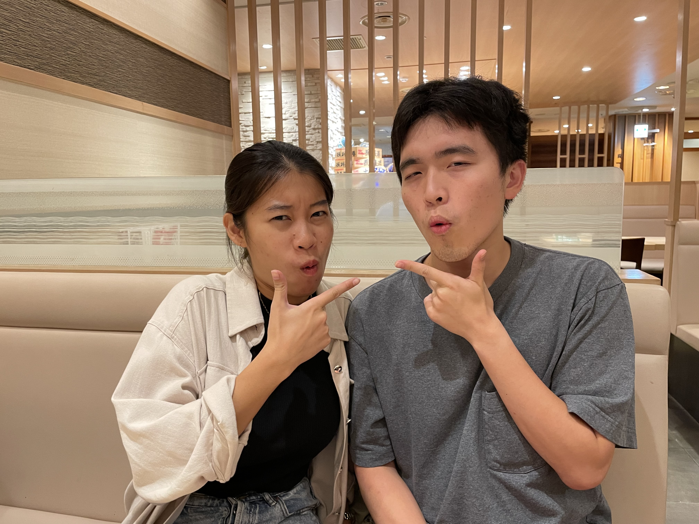
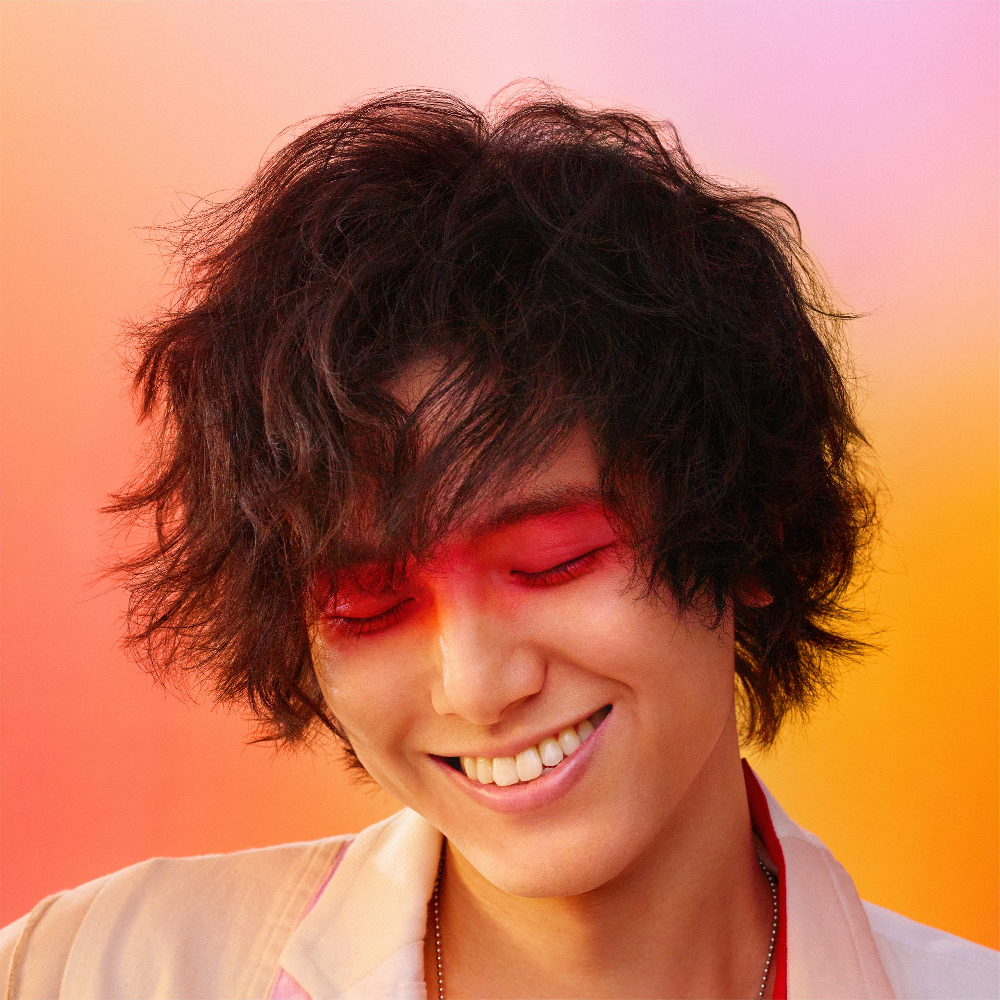
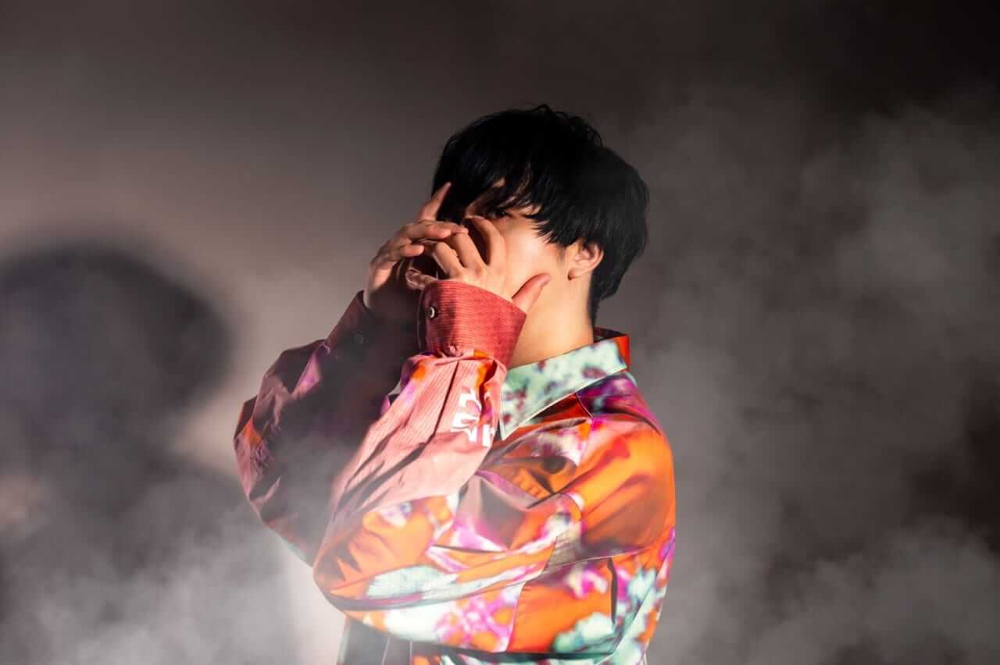

# Tatsuo Kumamoto's Page 

<br />

## Guiding through my page:
- [Short-Introduction](#short-introduction)
- [As a programmer](#as-a-student-and-a-programmer)
- [My Hobbies](#my-hobbies)
- [My Contacts](#my-contacts)

<br />


##### I am on the right!!
## Short-Introduction
##### My name is Tatsuo Kumamoto and I am a senior studying Applied Mathematics and computer science. I am an international student from Japan but I also have a Taiwanese background. 
<br />

## As a Student and a Programmer
##### I am currently taking 4 Courses: 
1. **CSE 151B** 
2. **CSE110**
3. MATH 140A
4. VIS 1

 These are both very challenging courses but I am taking my time to learn the concepts. So far my favorite command is: 
```
np.array.flatten();
```
##### because I feel that this command is kind of cute. But otherwise, codes and commands are usually not cute and as Professor Gary Cottrell says, whenever I see a bug, I go 
> NO! CASEY!  

<br />

##### The journey of coding has been a rollercoaster, but who doesn't enjoy a rollercoaster ride? Currently I have found an increasing interest in applied machine learning in music through a course I took over the sumer. I would like to explore more in CSE 151B and see if this is something that I will truly find fascinating. 

<br />

##### I am also very excited about what I can learn in my CSE 110 course because so far it seems that it will open another door for me. As an example, this is the [readme](./README.md) file that I have created on github through my terminal. Nothing special, but thought of just putting it out there :) 


<br />

## My Hobbies
##### I really like listening to music and singing while playing guitar. I think that music is a great way for me to remember times because I can remember a specific moment or time by relating to the music that I listened frequently around the same time. I've recorded me journey starting from 2019 when my college life started in UCSD in my [Spotify](https://open.spotify.com/user/e34hrc0l0kd2l809e2c12j82a?si=0bed9db599f24e82) playlists. 

##### I typically listen to Japanese music and here are some of my favorite artists:
<br />




<br />

- Left top: [Fujii Kaze](https://open.spotify.com/artist/6bDWAcdtVR3WHz2xtiIPUi?si=lxEdho2BR12ismrXqC4Vkw) (藤井風) → His songs are mostly pop song that incorporates jazzy vibes. Watching him enjoying performance will make you want to dance with him as well! There is a [song](https://open.spotify.com/track/0o9zmvc5f3EFApU52PPIyW?si=a97b327a0fb044ed) that is becoming popular on tiktok worldwide! Check it out!
<br />

- Right top: [Yorushika](https://open.spotify.com/artist/4UK2Lzi6fBfUi9rpDt6cik?si=Cu0JBzZiQ-yOgcK2e_5HMA)　(ヨルシカ) → Yorushika is a band composed of the vocalist, Suis, and music composer, n-buna. Nobody knows what they look like because they've never shown their face online! There is a live performance filmed on [Youtube](https://youtu.be/Ht6lcYg9Zfo) but you still can't see their faces 😩 By the way, I am practicing finger style guitar for the second song performed in this youtube link. The song is so soothing and warm ♪( ´θ｀)ノ
<br />

- Bottom: [Takase Naoya](https://open.spotify.com/artist/013zmpwJVA8E15pb1hM68O?si=94J2L6rfSJ-7pBFUCkDfGA)  (高瀬統也) → I was recently introduced to this artist by my Taiwanese friend and the first thing that struck me was the creativity in his title making for one of the song called, ["The 1st of the 13th month"](https://open.spotify.com/track/2TgikqWC5DnBOG4i4voigu?si=a2W7o3XiQCSwnrzk7zKq2w). He is a growing artist in Japan and my current [favorite song](https://open.spotify.com/track/35uvl8szo0IRhaoFgDdumu?si=Vvkko-A9Rx6UHtwSzcEpjw) sounds similar to the [EP](https://open.spotify.com/track/28QpCzFbTf09Jsj2zuz58t?si=TWDY0FvsRHWNkxPIIkKV8w) for one of my favorite anime called 86. So whenever I listen to this song, I remember the anime and how I was fascinated by the ending 😆

<br />
Some of my other hobbies that I have explored and have not yet explored include...

- [X] Cooking
- [X] Hang with Friends
- [X] Badminton
- [ ] Drawing
- [X] League of Legends
- [ ] Learning Korean
- [ ] Learning Keyboard
- [ ] Video Editing
- [ ] Dance


<br />

## My Contacts
##### This is my email: tkumamot@ucsd.edu

##### I use social media such as: [LinkedIn](https://www.linkedin.com/in/tatsuo-kumamoto/), [Instagram](https://www.instagram.com/ferbro_tits/), [Facebook](https://www.facebook.com/tatsuo.kumamoto.9/). Feel free to reach out to me!